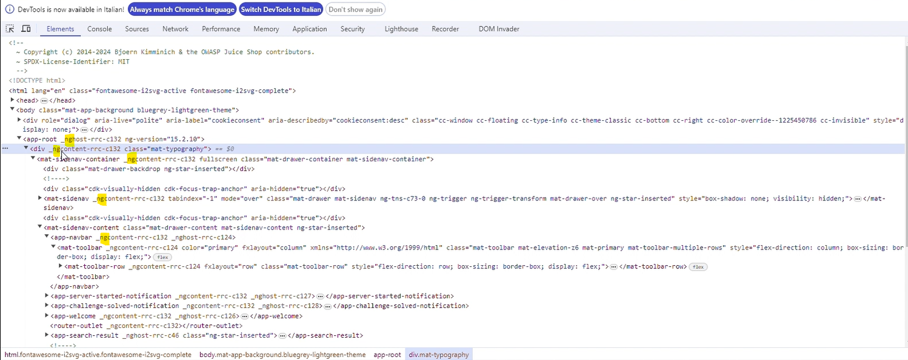
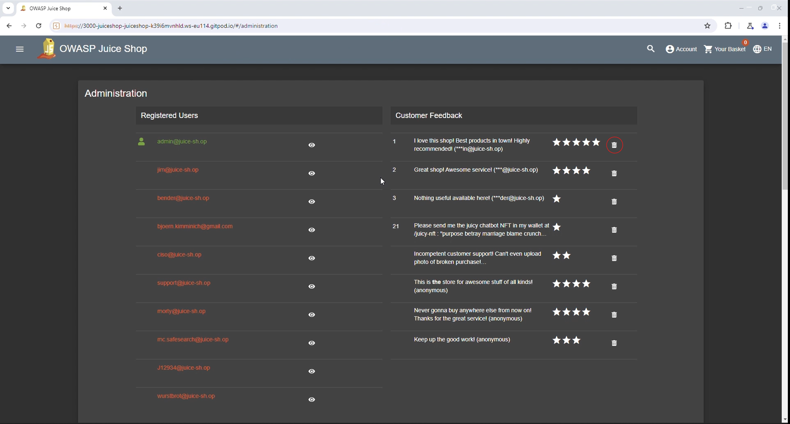
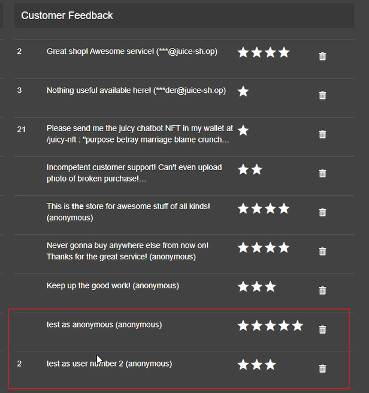

### Di Benedetto Andrea - Cybersecurity Course 2024 - UNITS
# Cybersecurity Report

## Table of Contents
  * [Introduction](#introduction)
  * [Implementation](#implementation)
  * [Conclusion](#conclusion)

## Introduction 

This report is about the exploitation of some vulnerabilities of the vulnerable [OWASP Juice Shop web application](https://owasp.org/www-project-juice-shop/).

I chose some of the proposed [Challenges](https://pwning.owasp-juice.shop/companion-guide/latest/appendix/solutions.html) and combined them in order to perform an attack that aims to delete and forge users’ feedbacks. In particular these are the challenges that I looked at: 
* [[ 1 ]](#1) [Log in with the administrator’s user account](https://pwning.owasp-juice.shop/companion-guide/latest/appendix/solutions.html#_log_in_with_the_administrators_user_account), 
* [[ 2 ]](#2) [Access the administration section of the store](https://pwning.owasp-juice.shop/companion-guide/latest/appendix/solutions.html#_access_the_administration_section_of_the_store), 
* [[ 3 ]](#3) [Get rid of all 5-star customer feedback](https://pwning.owasp-juice.shop/companion-guide/latest/appendix/solutions.html#_get_rid_of_all_5_star_customer_feedback), 
* [[ 4 ]](#4) [Post some feedback in another user’s name](https://pwning.owasp-juice.shop/companion-guide/latest/appendix/solutions.html#_post_some_feedback_in_another_users_name).

## Implementation 
### [ 1 ] Log in with the administrator’s user account

As a first step, I tried to access the web app through the login form using "admin" both as email and password in order to try to guess a possible default combination and generate some traffic. The application provided an invalid credential message.

Using [Burp Suite](https://portswigger.net/burp/communitydownload) I intercepted the HTTP requests and responses. 
The vast majority of web applications use some kind of SQL database. The basic SQL features are standardized, so many simple SQL queries work on any SQL database. Supposing the usage of SQL I constructed an injection attack to bypass authentication. 
The first account in a database is often an administrative user, and I exploited this behavior to log in as the first user in the database.

Using the Intercept functionality of Burp I sent a new login request from the browser to the server, intercepted it and, before frowarding it, I set the email field in this way:

`admin' or 1=1 --`

It is written in SQL language and is constructed this way:
* " ' "  is used to terminate the admin string
+ " or " is a logical operator
* " 1=1 " is an always true condition
+ " -- " introduces comments

This causes the application to perform a query of this type:

`<SELECT * FROM users WHERE username = 'admin' OR 1=1 --' AND password = 'admin'>`

Because the comment sequence (--) causes the remainder of the query to be ignored, this is equivalent to:

`<SELECT * FROM users WHERE username = 'admin' OR 1=1>`

That is always verified, thus obtaining from the server an authentication token in the response and then the access as administrator.

----

#### References and useful links of [ 1 ] 
[SQL injection](https://portswigger.net/web-security/sql-injection) - understanding how SQL injection works

[SQL injection cheat sheet](https://www.invicti.com/blog/web-security/sql-injection-cheat-sheet/) - understanding different variants of SQL injection

[Using SQL injection to bypass authentication](https://portswigger.net/support/using-sql-injection-to-bypass-authentication) - understanding the used SQL payload

[★ ★ Login Admin (Injection)](https://www.youtube.com/watch?v=LuU1fSuc7Gg&list=PL8j1j35M7wtKXpTBE6V1RlN_pBZ4StKZw&index=9) - Youtube guide

----

### [ 2 ] Access the administration section of the store

By using the developer tools' inspection functionality (F12) to inspect the code of the web app I repeatedly found the "ng" prefix, which means that the web app has been developed with [Angular](https://angular.dev/ ). 

In the [Angular Documentation](https://angular.dev/guide/routing/router-reference#configuration), it is said that "each Route maps a URL **path** to a component". Using the Debugger tool, I searched in the "main.js" JavaScript the **path** related to the administration page component. 

I tried to access the admin section by modifying the URL specifying the name of the found path `https:// ... /administration` but, without the login, I wasn't authorized to see the section. So I logged in as admin ( [[ 1 ]](#1) ) and it worked.

----

#### References and useful links of [ 2 ] 

[Routing in Angular](https://medium.com/@jaydeepvpatil225/routing-in-angular-924066bde43) - understanding what Angular is and how routing works in Angular

[★ ★ Admin Section (Broken Access Control)](https://www.youtube.com/watch?v=BPLhu354esc&list=PL8j1j35M7wtKXpTBE6V1RlN_pBZ4StKZw&index=11) - Youtube guide

----

### [ 3 ] Get rid of all 5-star customer feedback

This part was very easy because in the admin section ( that I accessed in [[ 2 ]](#2) ), there was a "Customer Feedback" section with all the feedbacks and the possibility of delete them.

In the administration section there is also a list of all the registered users. By intercepting the traffic related to the access to the admin section, I noticed a request-response exchange named `/rest/user/authentication-details/`. The response contained a JSON file with a lot of information about every single user that was listed, in particular the id is useful in the following steps.

----
#### References and useful links of [ 3 ] 

[Hacking OWASP’s Juice Shop Pt. 6: Admin Section](https://curiositykillscolby.com/2020/11/02/pwning-owasps-juice-shop-pt-6-admin-section/) - possible implementation

[★ ★ Five Star Feedback (Broken Access Control)](https://www.youtube.com/watch?v=9BsfRJA_-ik&list=PL8j1j35M7wtKXpTBE6V1RlN_pBZ4StKZw&index=13) - Youtube guide

---
### [ 4 ] Post some feedback in another user’s name

Without logging in, I accessed the Customer Feedback section from the side menu where there is a form to complete in order to submit a feedback. 
As a first step I used the feedback functionality as it is intended to understand how it works. So I started intercepting the traffic with Burp and I sent a test feedback.

The submission was successful and by looking at the POST response I noticed that there is an interesting entry in the data section named `UserId`. In this case its value was `Null` because I didn't log in (author was "anonymous"), but we found in [[ 3 ]](#3) that each user has a related id that we can exploit here for impersonation.

So I used the repeater functionality of Burp to send a new request where I added a `"UserId: "` entry filled with the id of the user I was going to impersonate and I modified the rating and comment as I wanted. 

The response was successful so I checked the feedback list in the administration section and my forged feedback was there.

----
#### References and useful links of [ 4 ] 

[★ ★ ★ Forged Feedback (Broken Access Control)](https://www.youtube.com/watch?v=99iKTSkZ814&list=PL8j1j35M7wtKXpTBE6V1RlN_pBZ4StKZw&index=25) - Youtube guide

---

## Conclusion 

In this implementation of a simple attack on a vulnerable web application, I exploited different vulnerabilities related to the design and implementation of the web app itself. In fact the main weaknesses exploited were those related to the lack of authorization checks and to the possibility of improper modification of Dynamically-Determined Object Attributes.

[Initial access](https://attack.mitre.org/tactics/TA0001/) has been performed thanks to the SQL Injection attack, which can be considered as an [Exploit Public Facing Application](https://attack.mitre.org/techniques/T1190/) technique. With this approach I bypassed the authentication obtaining access to a high privilege account.

That account combined with an IDOR vulnerability allowed me to easily reach the administration section. Then I exploited the fact that the page suffers from [Mass Assignment](https://cheatsheetseries.owasp.org/cheatsheets/Mass_Assignment_Cheat_Sheet.html) vulnerability to gain data about other users and used this information to impersonate them.

----
#### References and useful links related to Conclusion 
[OWASP Cheat Sheet](https://cheatsheetseries.owasp.org/index.html) - Concise collection of high value information on specific application security topics.

[CWE-915: Improperly Controlled Modification of Dynamically-Determined Object Attributes](https://cwe.mitre.org/data/definitions/915.html) - specific weakness

[CWE-285: Improper Authorization](https://cwe.mitre.org/data/definitions/285.html) - specific weakness

[OWASP API Security Top 10](https://owasp.org/API-Security/) - The OWASP API Security Project seeks to provide value to software developers and security assessors by underscoring the potential risks in insecure APIs, and illustrating how these risks may be mitigated
